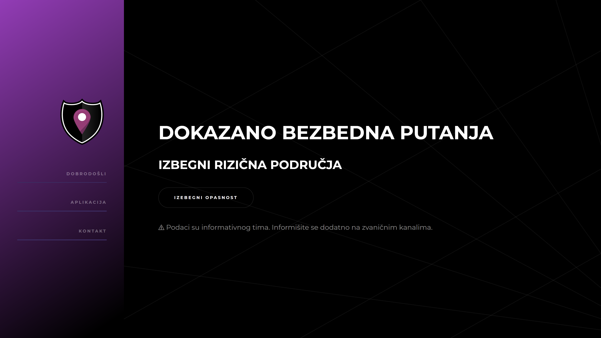

# Proven to be safe

App designed to warn about high risk places on a particular route.

## Prerequisites

Npm: <https://www.npmjs.com/>

Python: <https://www.python.org/>

### Description
This project was done for 2021 hackathon by Fakultet Organizacionih Nauka(FON). Hackathon theme were emergencies, so we decided to make web application that can warn about high risk spots on a specific route. You simply enter two cities on google maps API, then aplication finds big cities you need to go through and then searches government and media web sites to get latest information about danger spots on route. In the end, aplication displays danger index for every city that you need to pass.

Prezi presentation(in Serbian): https://prezi.com/p/7wpsge-l6jx2/dokazano-bezbedno/

#### Authors
-   **Momcilo Knezevic**
-   **Stefan Durlevic**
-   **Mihailo Vlajkovic**
-   **Djordje Tanaskovic**
